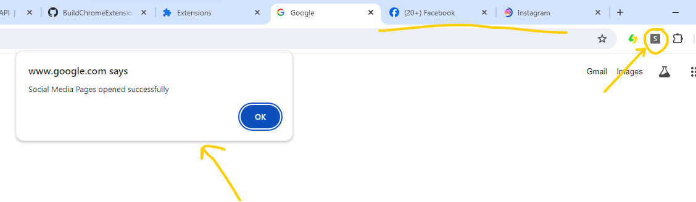

# Social Media Manager



A chrome extension that when the popup icon is clicked it will open 3 social media tabs Facebook, Instagram, YouTube. It will also send a message to the content script of the active tab to show an alert that social media pages were just opened. However we also want the chrome extension to redirect to Google went every a user tries to go on LinkedIn. Our target audience are a bunch of LinkedIn addicts.

## Google Chrome Tabs API Documentation
```
https://developer.chrome.com/docs/extensions/reference/api/tabs
```

## How we are going to do it
For finding and opening the tabs we are going to use <b>chrome.tabs.query</b> and <b>chrome.tabs.create</b> functions.

We are then going to use chrome.tabs API <a href="https://developer.chrome.com/docs/extensions/reference/api/tabs#event">events</a> to run code when a tab has been created or updated and then redirect it accordingly.